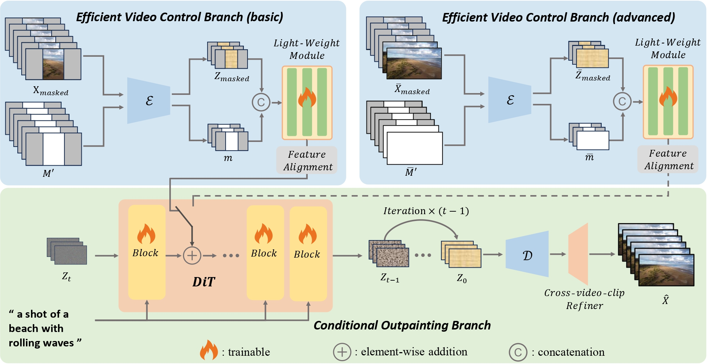

# OutDreamer





https://github.com/user-attachments/assets/1de99952-eb16-4e9f-9703-12e962138e10


### Setup

```
conda create -n outdreamer python=3.8 -y
conda activate outdreamer
pip install torch==2.1.0 torchvision==0.16.0 --index-url https://download.pytorch.org/whl/cu118
pip install xformers==0.0.22.post7 --index-url https://download.pytorch.org/whl/cu118
pip install -e .
pip install -e ".[train]"
pip install -e ".[dev]"
```

### Download

* Pre-trained DiT model Weights  
  * We use pre-trained DiT model of [Open-Sora-Plan](https://github.com/Vchitect/Latte). To get the pre-trained DiT model weights, download them from the following link and put them into `pretrained_models/models--LanguageBind--Open-Sora-Plan-v1.2.0/29x720p` 
  * https://huggingface.co/LanguageBind/Open-Sora-Plan-v1.2.0/tree/main/29x720p
* VAE Weights
  * We use pre-trained VAE of [Open-Sora-Plan](https://github.com/Vchitect/Latte). To get the pre-trained VAE weights, download them from the following link and  put them into `pretrained_models/models--LanguageBind--Open-Sora-Plan-v1.2.0/vae` :
  * https://huggingface.co/LanguageBind/Open-Sora-Plan-v1.2.0/tree/main/vae

### train

You can run the example training code with the following command:

```
bash scripts/train_outpaint.sh
```

The example training process is based on two example video datas in `data/train_data/` as well as its meta json file in `data/data_json.json`. 

You can simply place the video data into the `data/train_data/` directory and update the `data/data_json.json` file according to the template in actual training. The video data used in our experiments is sourced from https://huggingface.co/datasets/LanguageBind/Open-Sora-Plan-v1.1.0/tree/main/pexels 

Please refer to `scripts/train_outpaint.sh` for more training details.

### Inference

After the training process,  you can run the example inference code with the following command:

```
bash scripts/sample_outpaint.sh
```

We provide two examples for sampling, and please refer to `scripts/sample_outpaint.sh` for more inference details.

Due to company policy, we are unable to provide the pre-trained OutDreamer model weights. Please train the model yourself using the provided training scripts.


### Acknowledgement
Our project is based on [Open-Sora-Plan](https://github.com/Vchitect/Latte) and we are grateful for its open-source nature.

